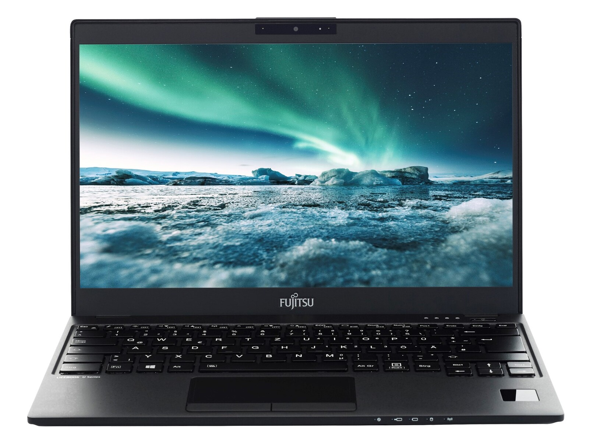

# FUJITSU LIFEBOOK U939 詳細レビュー

## 概要

FUJITSU LIFEBOOK U939は、富士通が2019年から2020年にかけて発売した13.3インチの超軽量ビジネスノートパソコンです[1][2]。約898gという軽量性と堅牢性を両立したモバイルワークステーションとして、多くのビジネスユーザーから高い評価を受けています[3][4]。

## 製品詳細

https://jp.fujitsu.com/platform/pc/product/lifebook/1907/u939b/

## 主要スペック

### 基本仕様

| 項目 | 仕様 |
|------|------|
| 画面サイズ | 13.3インチワイド、フルHD（1920×1080ドット）[2][3] |
| CPU | 第8世代Intel Core i5-8265U/8365U/8665U[3][5] |
| メモリ | 8GB～16GB LPDDR3-2133（オンボード）[2][6] |
| ストレージ | SSD 256GB[3][5] |
| 重量 | 約898g～920g[3][6] |
| サイズ | 309×15.5×212mm[3][5] |
| OS | Windows 10 Pro（後にWindows 11対応）[2][5] |

### ディスプレイ

U939は13.3インチのフルHD液晶ディスプレイを搭載し、アンチグレア処理により屋外での視認性を向上させています[2][4]。最大1677万色の表示が可能で、長時間の作業でも目が疲れにくい設計となっています[4]。

### バッテリー性能

メーカー公称値として約21時間の連続駆動時間を実現していますが、実際の使用環境では約10-11時間程度の駆動が期待できます[1][6][4]。外出先での長時間作業にも対応できる大容量バッテリーを搭載しています[1]。

## インターフェース・接続性

### 豊富なポート類

- USB 3.1 Type-A × 2ポート[5][7]
- USB 3.1 Type-C × 2ポート（Thunderbolt 3対応）[6][7]
- HDMI出力端子 × 1[5][7]
- LANポート（引き出し式）[5][7]
- SDカードスロット[5][7]
- ヘッドフォン/マイク兼用ジャック[7]

### 通信機能

無線LAN（IEEE 802.11a/b/g/n/ac準拠）とBluetooth 5.0を標準搭載しており、現代的な接続性を提供しています[5][7]。一部モデルではLTE対応版も用意されています[7]。

## 設計・構造の特徴

### 軽量化技術

U939の最大の特徴は、わずか約898gという驚異的な軽さです[3]。この軽量化は、マグネシウム合金製のボディや薄型設計により実現されており、持ち運び時の負担を大幅に軽減しています[4]。

### 堅牢性

軽量でありながら、富士通独自の堅牢性テストをクリアしており、ビジネス環境での使用に十分な耐久性を備えています[4]。マグネシウム合金製のボディは、薄くて軽いにも関わらず非常に頑丈な構造となっています[4]。

## セキュリティ機能

### 生体認証

- 指紋認証センサー（内蔵型タッチ式）[2][7]
- Windows Hello対応顔認証（Webカメラ経由）[2][7]
- オプションで手のひら静脈認証にも対応[7]

### その他セキュリティ

TPMセキュリティチップ（TCG Ver2.0準拠）を搭載し、企業レベルのセキュリティ要件にも対応しています[7]。Intel vPro技術にも対応しており、企業での遠隔管理も可能です[7]。

## 実際の使用感・レビュー

### ユーザー評価

実際のユーザーからは以下のような評価が寄せられています[4]：

- 「とにかく軽くて持ち運びに便利。出張が多いので、本当に助かっています」
- 「軽さと堅牢性のバランスが素晴らしい。安心して持ち運べる」
- 「起動が速くて、サクサク動く。ストレスなく仕事ができる」
- 「キーボードが打ちやすい。タッチパッドの反応も良い」

### パフォーマンス

第8世代Intel Core i5プロセッサーを搭載し、一般的なビジネス用途には十分な性能を提供します[4]。SSDの採用により、起動やアプリケーションの立ち上げが高速で、ストレスフリーな操作が可能です[4]。

## 価格・入手性

### 中古市場での価格

現在、U939は中古市場で以下のような価格帯で販売されています：
- 一般的な中古品：約2万円～3.5万円[8][9]
- 高スペック版（Core i7、16GBメモリ）：約7万円程度[6]

### 新品での販売

2020年の発売終了後、新品での入手は困難となっており、主に中古品やリファービッシュ品での販売となっています[10][8]。

## 他機種との比較

### 軽量ノートPC市場での位置

軽量ノートPC市場において、U939は約898gという重量で競合他社製品と比較しても優秀な軽量性を誇ります[11]。現在の軽量ノートPCランキングでは、より新しいモデルに順位を譲っていますが、コストパフォーマンスの観点では依然として魅力的な選択肢となっています[12][11]。

## 注意点・制限事項

### メモリ増設

U939のメモリはオンボード実装のため、購入後の増設はできません[2][12]。購入時のメモリ容量選択が重要となります。

### サポート期間

2019-2020年発売のモデルのため、メーカーサポートが終了している可能性があります[13]。修理が必要な場合は、専門業者への依頼を検討する必要があります。

## まとめ

FUJITSU LIFEBOOK U939は、約898gという驚異的な軽量性と実用的なビジネス機能を両立した優秀なモバイルノートパソコンです[3][4]。現在は中古市場での入手が主となりますが、モバイルワークを重視するユーザーにとって魅力的な選択肢として評価されています[4][8]。特に出張や外出先での作業が多いビジネスユーザーにおすすめできる一台です[4]。

情報源
[1] 富士通 ノートパソコン（PC） LIFEBOOK U939/A 製品詳細 https://jp.fujitsu.com/platform/pc/product/lifebook/u939a/
[2] 富士通 ノートパソコン（PC） LIFEBOOK U939/A 仕様 https://jp.fujitsu.com/platform/pc/product/lifebook/u939a/spec.html
[3] 富士通 LIFEBOOK U939/CX FMVU2604EP スペック・仕様 - 価格.com https://kakaku.com/item/K0001266053/spec/1000/
[4] ライフブック U939の実体験のレビューと口コミを紹介｜旅行好きさん https://note.com/unique_chimp63/n/n930992f549ba
[5] LIFEBOOK U ノートパソコン Webカメラ付き 富士通 U939 極薄軽量約898g 13.3型フルHD 8世代Core i5-8365U vPro SSD256GB メモリ8GB Type-C HDMI Windows11 Office : ALEXPC Yahoo!店 - 通販 - Yahoo!ショッピング https://store.shopping.yahoo.co.jp/alexpc/s2292.html
[6] 2019年式 LIFEBOOK U939/B Core i7第8世代 / メモリ16GB ... https://honpokunpc.base.ec/items/91860911
[7] LIFEBOOK U939/BW 仕様 - 富士通 WEB MART https://direct.jp.fujitsu.com/biz-ui6705.html
[8] 「lifebook u939」の人気商品 - 価格.com https://search.kakaku.com/lifebook%20u939/
[9] 富士通13.3型モバイルノート「LIFEBOOK U939/A」が19800円 https://akiba-pc.watch.impress.co.jp/docs/news/news/2016483.html
[10] 富士通 LIFEBOOK U939/CX FMVU2604EP - 価格.com https://kakaku.com/item/K0001266053/
[11] 1kgを切る軽量ノートパソコンランキング - the比較 https://thehikaku.net/pc/new/hikaku-karui.html
[12] 【2025年最新】最軽量ノートPC徹底比較！Fujitsu Lifebook U937 ... https://note.com/ideal_peony3412/n/n3d71ac09703e
[13] LIFEBOOK U939ノートパソコンのモニターが不良です。 改善策は ... https://detail.chiebukuro.yahoo.co.jp/qa/question_detail/q14314526449
[14] 【楽天市場】lifebook u939の通販 https://search.rakuten.co.jp/search/mall/lifebook+u939/
[15] Fujitsu Lifebook U939 Laptop Review: A compact business ... https://www.notebookcheck.net/Fujitsu-Lifebook-U939-Laptop-Review-A-compact-business-notebook-with-LTE.481035.0.html
[16] 【2025年】軽量ノートパソコンのおすすめ20選 1kg以下の薄型 ... https://www.biccamera.com/bc/i/topics/osusume_mobilelaptop/index.jsp
[17] 【2025年版】軽量ノートパソコンのおすすめ22選。1kg以下の ... https://sakidori.co/article/93786
[18] 富士通 LIFEBOOK MU937の軽量・薄型設計が支持される理由を解説 https://note.com/holy_beetle811/n/nbd4b79ba4a32
[19] [PDF] FUJITSU Notebook LIFEBOOK https://jp.fujitsu.com/platform/pc/product/catalog_syskou/catalog/bib/ctlg_lifebook_202101_2.pdf
[20] 【即納パソコン】LIFEBOOK U939/A (Win11pro64)(SSD新品) https://www.pasel.co.jp/note/fujitsu/Windows11/particulars/41291
[21] LIFEBOOK U938/T 製品詳細 - 富士通｜Fujitsu Limited https://jp.fujitsu.com/platform/pc/product/lifebook/u938t/
[22] 富士通 ノートパソコン（PC） LIFEBOOK U939/C 製品詳細 https://jp.fujitsu.com/platform/pc/product/lifebook/u939c/
[23] 「lifebook u939 ノートパソコン」の人気商品 - 価格.com https://search.kakaku.com/lifebook%20u939%20%E3%83%8E%E3%83%BC%E3%83%88%E3%83%91%E3%82%BD%E3%82%B3%E3%83%B3/
[24] 富士通 ノートパソコン（PC） LIFEBOOK U939/C 仕様 https://jp.fujitsu.com/platform/pc/product/lifebook/u939c/spec.html
[25] 【最新版】1kg以下のノートパソコン 人気売れ筋ランキング - 価格.com https://kakaku.com/pc/note-pc/itemlist.aspx?altTitle=00034
[26] 軽量・薄型のノートパソコンのおすすめ人気ランキング【2025年】 https://my-best.com/23958
[27] 【2025年】薄型・軽量のノートパソコンおすすめ16選！ https://www.yamada-denkiweb.com/media/28409/
[28] 【現行17選！】軽量・薄型のおすすめノートパソコン【2025年3月 ... https://yrpc.jp/osusume-note-pc/%E3%81%8A%E3%81%99%E3%81%99%E3%82%81%E3%81%AE%E8%BB%BD%E9%87%8F%E3%83%BB%E8%96%84%E5%9E%8B%E3%83%8E%E3%83%BC%E3%83%88%E3%83%91%E3%82%BD%E3%82%B3%E3%83%B3/
